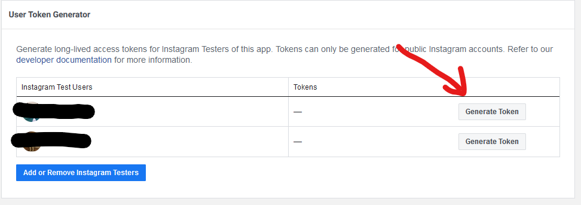

# BBS Technical Test

## About
This app was made for a technical test.

The point of this test is to make a Laravel app that fetch some pictures from an Instagram account.

## Set up
Before something else you'll need to follow [this guide](https://developers.facebook.com/docs/instagram-basic-display-api/getting-started).
To use the Instagram API you need an app and a token.

Then, you have to put your tester user token in the .env file like that :
```INSTAGRAM_TOKEN='YOUR TOKEN'```

You can find your token here :


## Run the tests
To run the test simply run this command :
```$ php artisan test```

## Run the app
To run the app simply run this command :
```$ php artisan serve```

## Run it with Docker
To run the app with Docker compose simply run this command :
```$ sudo docker-compose up```